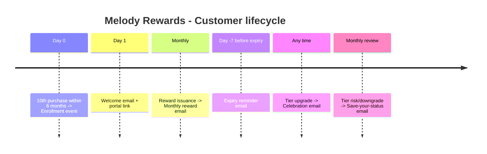

# Melody Events: Salesforce Marketing Cloud Architecture
### CRM Data Model, Loyalty Program, and Data 360 Strategy

---

## Assumptions

A few things worth calling out before diving in:

- The standard Salesforce **Contract** object is used for B2B agreements. The existing `Order_Info` DE maps to this in CRM where `Order Type = 'Contract'`. Ticket purchases map to Salesforce standard **Order** records.
- **Person Accounts are not yet enabled** in the Melody Events org. Enabling them is part of this proposal and is irreversible, so it requires a deliberate decision.
- The "responsible managers" in the renewal alert requirement refers to **Melody Events' internal account managers** (the Account Owner in Salesforce), not the client contacts.
- **Marketing Cloud Connect is already installed** at the Enterprise level and syncs CRM objects to SFMC every 15 minutes.
- The **18-character Salesforce ContactId is used as Subscriber Key** in SFMC throughout.
- Data 360 is licensed but not yet configured.
- The term "organization" in Scenario 1 Q2 refers to **B2B clients** (theatres, promoters, festival organizers) using Melody Events' platform.

---

## Table of Contents

1. [Scenario 1: CRM Object Model and Contract Management](#scenario-1-crm-object-model-and-contract-management)
   - [Q1: Modelling the two subscriber types](#q1-how-would-you-model-the-two-separate-subscriber-types)
   - [Q2: Dedicated data source for client organizations](#q2-dedicated-data-source-for-organizations-on-the-platform)
   - [Q3: Handling duplicate primary contacts](#q3-ensuring-duplicate-primary-contacts-are-handled-correctly)
   - [Internal renewal alert process](#internal-alert-process-weekly-contract-renewal-reminders-to-managers)
2. [Scenario 2: Loyalty Program Lifecycle](#scenario-2-loyalty-program-lifecycle)
   - [Q1: Loyalty programme proposal and journeys](#q1-propose-a-suitable-loyalty-programme-and-corresponding-journeys)
   - [Q2: Data model and SQL automation](#q2-data-model-and-sql-automation)
   - [Q3: Self-service portal architecture](#q3-self-service-portal-architecture)
     - [3a: Sensitive personal details](#3a-how-to-handle-sensitive-personal-details)
     - [3b: Marking and not displaying used coupons](#3b-marking-and-not-displaying-used-coupons)
3. [Scenario 3: Data 360 Capabilities](#scenario-3-data-360-capabilities)
   - [Data ingestion strategy](#what-data-to-ingest-into-data-360)
   - [First use case and identity resolution](#which-business-use-case-to-tackle-first)
   - [Segment activation to SFMC](#how-to-activate-segments-into-marketing-cloud)
   - [MC on Core use cases](#specific-use-cases-for-mc-on-core)
4. [Section 4: SSJS CloudPage Exercise](#section-4-ssjs-cloudpage-exercise)

---

## SCENARIO 1: CRM Object Model and Contract Management

---

### Q1: How would you model the two separate subscriber types?

The cleanest way to separate B2B clients from B2C customers in Salesforce is to use **two distinct Account models** that live side by side in the same org:

- **Business Accounts with Contacts** for B2B clients (theatres, promoters, festival organizers)
- **Person Accounts** for B2C customers (individuals buying tickets)

**Why Person Accounts for B2C?** A Person Account merges the Account and Contact objects into a single record, which is exactly what you need for an individual consumer: one record, one email address, one identity. Salesforce creates a hidden Contact record behind the scenes (accessible via `PersonContactId`), and Marketing Cloud Connect automatically picks this up as the SFMC subscriber. You can read the full Salesforce implementation guide here: [Implementing Person Accounts (Salesforce PDF)](https://resources.docs.salesforce.com/latest/latest/en-us/sfdc/pdf/impl_person_accounts.pdf).


> [!IMPORTANT]
> This is a **one-way, irreversible change** to the org. It must be requested through Salesforce Support or enabled in Setup. Before enabling, ensure the Account object has at least one existing Record Type, as Salesforce requires separate record types for Person Accounts and Business Accounts.
 


**Key fields to differentiate subscriber types across the data model:**

| Object | Field | Type | Purpose |
|--------|-------|------|---------|
| Account | `RecordTypeId` | Standard | Distinguishes Person Account from Business Account |
| Account | `IsPersonAccount` | Boolean (read-only) | System-set to TRUE for Person Accounts |
| Account | `PersonContactId` | Lookup | Hidden Contact Id for Person Accounts, used as SFMC Subscriber Key |

In Marketing Cloud Connect, **both subscriber types flow through ContactId as the Subscriber Key**:
- B2C customers: `PersonContactId` from the Person Account record
- B2B contacts: standard `Contact.Id`

This single-key strategy means all SFMC unsubscribes, engagement data, and journey history link back to one consistent identifier in CRM.


### CRM data structure: Business Accounts (B2B) vs Person Accounts (B2C)


**Sendable Data Extensions in SFMC** are then populated via SQL from the Synchronized DEs:

**DE: `Sendable_B2C_Customers`** (Sendable, Subscriber Key = SubscriberKey field, relates to _Subscribers on SubscriberKey)

| Field | Type | Length | Notes |
|-------|------|--------|-------|
| SubscriberKey | Text | 18 | Salesforce PersonContactId |
| EmailAddress | EmailAddress | 254 | |
| FirstName | Text | 80 | |
| LastName | Text | 80 | |
| PersonAccountId | Text | 18 | Salesforce Account Id |
| Phone | Phone | 20 | |
| City | Text | 100 | |
| LastPurchaseDate | Date | | |
| TotalTicketsPurchased | Number | | |

```sql
SELECT
    a.PersonContactId                AS SubscriberKey,
    c.Email                          AS EmailAddress,
    c.FirstName,
    c.LastName,
    c.Phone,
    a.BillingCity                    AS City,
    c.Last_Purchase_Date__c          AS LastPurchaseDate,
    c.Total_Tickets_Purchased__c     AS TotalTicketsPurchased
FROM Contact_Salesforce c
INNER JOIN Account_Salesforce a
    ON c.AccountId = a.Id
WHERE a.IsPersonAccount = 1
  AND a.PersonContactId IS NOT NULL
  AND c.Email IS NOT NULL
  AND c.HasOptedOutOfEmail = 0
```


**DE: `Sendable_B2B_Contacts`** (Sendable, Subscriber Key = SubscriberKey)

| Field | Type | Length | Notes |
|-------|------|--------|-------|
| SubscriberKey | Text | 18 | Salesforce Contact.Id |
| EmailAddress | EmailAddress | 254 | |
| FirstName | Text | 80 | |
| LastName | Text | 80 | |
| CompanyName | Text | 255 | Account.Name |
| AccountId | Text | 18 | Salesforce Account Id |
| AccountType | Text | 50 | Promoter / Venue / Festival_Organizer |
| Title | Text | 128 | |
| ContractStatus | Text | 50 | Active / Expiring / Expired |

```sql
SELECT
    c.ContactId                      AS SubscriberKey,
    c.Email                          AS EmailAddress,
    c.FirstName,
    c.LastName,
    a.Name                           AS CompanyName,
    a.Id                             AS AccountId,
    a.AccountType                    AS AccountType,
    c.Title,
    ct.Status                        AS ContractStatus
FROM Contact_Salesforce c
INNER JOIN Account_Salesforce a
    ON c.AccountId = a.Id
LEFT JOIN Contract_Salesforce ct
    ON ct.AccountId = a.Id
WHERE (a.IsPersonAccount = 0 OR a.IsPersonAccount IS NULL)
  AND c.ContactId IS NOT NULL
  AND c.Email IS NOT NULL
  AND c.HasOptedOutOfEmail = 0
```


---

### Q2: Dedicated data source for organizations on the platform

To give sales managers a clean, organized view of all B2B clients using the platform, two non-sendable DEs act as the master reference for client organization data:

**DE: `Platform_Organizations`** (Non-sendable, PK = AccountId)

| Field | Type | Notes |
|-------|------|-------|
| AccountId | Text(18) | PK, Salesforce Account.Id |
| OrganizationName | Text(255) | |
| AccountType | Text(50) | Promoter / Venue / Festival_Organizer |
| PlatformTier | Text(30) | Basic / Pro / Enterprise |
| OnboardingDate | Date | |
| IsActive | Boolean | |
| TotalEventsListed | Number | Events using ME's platform |
| HealthScore | Number | 1-100 calculated engagement score |

**DE: `Platform_Contracts`** (Non-sendable, PK = ContractId)

| Field | Type | Notes |
|-------|------|-------|
| ContractId | Text(18) | PK |
| AccountId | Text(18) | FK to Platform_Organizations |
| ContractStartDate | Date | |
| ContractEndDate | Date | |
| ContractValue | Decimal(12,2) | |
| ContractStatus | Text(30) | Active / Expiring_Soon / Expired / Renewed |
| AutoRenew | Boolean | |
| DaysUntilRenewal | Number | Recalculated daily |
| PrimaryContactId | Text(18) | FK to Sendable_B2B_Contacts.SubscriberKey |
| PrimaryContactEmail | EmailAddress | |
| OwnerEmail | EmailAddress | Melody Events account manager's email |
| OwnerFirstName | Text(80) | |
| OwnerLastName | Text(80) | |

> **Assumption:** Some formula fields, like `Owner_Email__c` were added to the Salesforce Contract object to pull the Account Owner's email. This syncs directly to SFMC without requiring a separate User object sync.

```sql
SELECT
    con.Id                        AS ContractId,
    con.AccountId                 AS AccountId,
    con.StartDate                 AS ContractStartDate,
    con.EndDate                   AS ContractEndDate,
    con.TotalContractValue        AS ContractValue,
    con.Status                    AS ContractStatus,
    con.AutoRenew__c              AS AutoRenew,
    DATEDIFF(day, GETDATE(), con.EndDate) AS DaysUntilRenewal,
    con.Owner_Email__c            AS OwnerEmail,
    con.Owner_FirstName__c        AS OwnerFirstName,
    con.Owner_LastName__c         AS OwnerLastName
FROM Contract_Salesforce con
INNER JOIN Account_Salesforce a
    ON con.AccountId = a.Id
WHERE (a.IsPersonAccount = 0 OR a.IsPersonAccount IS NULL)
```


This DE becomes the single source of truth for all B2B contract reporting, segmentation, and alert triggering. It separates client organization management cleanly from the customer purchase data in `Order_Info`.


### Data Designer: Business Accounts (B2B) vs Person Accounts (B2C)


---

### Q3: Ensuring duplicate primary contacts are handled correctly

There are two types of duplicates to think about separately: accidental duplicates (data entry errors that should be prevented) and intentional duplicates (a B2B contact who also buys tickets personally, which the requirement explicitly allows).

**Preventing accidental duplicates:**

In Salesforce Setup, configure a **Matching Rule** on the Contact object using Email + First Name + Last Name (fuzzy). Attach a **Duplicate Rule** set to "Alert" on save. This surfaces a warning when someone tries to create a contact that already exists due to a data entry error.


**The intentional duplicate (3A): when a B2B primary contact buys tickets personally**

When a primary contact at a client company (e.g., the venue manager at a promoter account) purchases tickets for themselves, a new **Person Account** is created in Salesforce to represent their B2C identity. This gives them two separate records in the system:

- **Record 1 (B2B):** A Contact under the client's Business Account, used for contract and platform communication
- **Record 2 (B2C):** A Person Account tied to their ticket purchase history

These map to different SFMC Data Extensions automatically: the B2B Contact flows into `Sendable_B2B_Contacts`, and the Person Account flows into `Sendable_B2C_Customers` via its hidden `PersonContactId`. Each has its own Subscriber Key, its own engagement history, and receives only the communications relevant to that context.

The two records are structurally different at the data model level:

| | B2B Contact | B2C Person Account |
|-|-------------|-------------------|
| `IsPersonAccount` | FALSE | TRUE |
| Account type | Business Account (Promoter / Venue / etc.) | Person Account |
| Record Type | Standard Contact | Person Account |
| SFMC DE | `Sendable_B2B_Contacts` | `Sendable_B2C_Customers` |

No custom field is needed to tell them apart, anyone looking at either record in Salesforce will immediately see they belong to different account types and contexts. List views, reports, and Contact Builder attribute groups all reflect this distinction natively.


**Configuring the Duplicate Rule to allow this case:**

The Matching Rule would normally flag the B2C Person Account as a potential duplicate of the B2B Contact, since they share the same name and/or email. To prevent false alerts, add a filter condition to the Matching Rule that **excludes Person Account contacts** from the B2B Contact match scope. In Salesforce, this is done by adding `IsPersonAccount = FALSE` as a filter on the matching object, so Person Accounts are never compared against standard Business Account contacts.

> [!TIP]
> Use a distinct page layout for each Record Type to make it easier to find relevant information quickly and identify the type of contact at a glance.
>
> **Object > Record Type > Page Layout Assignment > Edit Assignment**

---

### Internal Alert Process: Weekly Contract Renewal Reminders to Managers

The goal is an **internal alert system** that emails Melody Events' own account managers when their assigned client contracts are approaching expiry. Alerts fire at three thresholds: 30 days, 10 days, and the final day. On the final day, the client's Account record in Salesforce is also flagged as "At Risk."

**Overall approach:** Automation Studio prepares the data, Journey Builder handles the sends and CRM write-back.


#### Data Extensions

**DE: `RenewalAlerts_Send`** (Sendable, PK = ContractId + AlertType composite)

| Field | Type | Notes |
|-------|------|-------|
| SubscriberKey | Text(18) | Melody Events account manager's Salesforce User.Id or unique identifier |
| EmailAddress | EmailAddress | Manager's internal email address |
| ManagerFirstName | Text(80) | |
| ManagerLastName | Text(80) | |
| AccountId | Text(18) | Client's Salesforce Account Id |
| AccountName | Text(255) | Client company name |
| ContractId | Text(18) | |
| ContractEndDate | Date | |
| DaysToExpiry | Number | |
| AlertType | Text(20) | 30Day / 10Day / FinalDay |
| ClientContactEmail | EmailAddress | Client's primary contact email |


**DE: `RenewalAlertLog`** (Non-sendable, PK = ContractId + AlertType, used for de-duplication)

| Field | Type | Notes |
|-------|------|-------|
| ContractId | Text(18) | |
| AlertType | Text(20) | |
| SentDate | Date | When this alert tier was last sent |
| SentToEmail | EmailAddress | Manager's email |


#### SQL Queries (UNION ALL approach)

A single SQL Query Activity combines all three alert tiers, filtering against the log DE to avoid re-sending the same alert within the same window.

```sql
SELECT
    x.SubscriberKey,
    x.EmailAddress,
    x.ManagerFirstName,
    x.ManagerLastName,
    x.AccountId,
    x.AccountName,
    x.ContractId,
    x.ContractEndDate,
    x.DaysToExpiry,
    x.AlertType,
    x.ClientContactEmail
FROM (
    SELECT
        a.OwnerId AS SubscriberKey,
        a.Owner_Email__c AS EmailAddress,
        a.Owner_FirstName__c AS ManagerFirstName,
        a.Owner_LastName__c AS ManagerLastName,
        a.Id AS AccountId,
        a.Name AS AccountName,
        con.Id AS ContractId,
        con.EndDate AS ContractEndDate,
        DATEDIFF(day, GETDATE(), con.EndDate) AS DaysToExpiry,
        '30Day' AS AlertType,
        pc.Email AS ClientContactEmail
    FROM Contract_Salesforce con
    INNER JOIN Account_Salesforce a
        ON con.AccountId = a.Id
    INNER JOIN Contact_Salesforce pc
        ON a.Id = pc.AccountId
    WHERE con.Status = 'Active'
      AND DATEDIFF(day, GETDATE(), con.EndDate) BETWEEN 11 AND 30
      AND a.Owner_Email__c IS NOT NULL

    UNION ALL

    SELECT
        a.OwnerId AS SubscriberKey,
        a.Owner_Email__c AS EmailAddress,
        a.Owner_FirstName__c AS ManagerFirstName,
        a.Owner_LastName__c AS ManagerLastName,
        a.Id AS AccountId,
        a.Name AS AccountName,
        con.Id AS ContractId,
        con.EndDate AS ContractEndDate,
        DATEDIFF(day, GETDATE(), con.EndDate) AS DaysToExpiry,
        '10Day' AS AlertType,
        pc.Email AS ClientContactEmail
    FROM Contract_Salesforce con
    INNER JOIN Account_Salesforce a
        ON con.AccountId = a.Id
    INNER JOIN Contact_Salesforce pc
        ON a.Id = pc.AccountId
    WHERE con.Status = 'Active'
      AND DATEDIFF(day, GETDATE(), con.EndDate) BETWEEN 2 AND 10
      AND a.Owner_Email__c IS NOT NULL

    UNION ALL

    SELECT
        a.OwnerId AS SubscriberKey,
        a.Owner_Email__c AS EmailAddress,
        a.Owner_FirstName__c AS ManagerFirstName,
        a.Owner_LastName__c AS ManagerLastName,
        a.Id AS AccountId,
        a.Name AS AccountName,
        con.Id AS ContractId,
        con.EndDate AS ContractEndDate,
        0 AS DaysToExpiry,
        'FinalDay' AS AlertType,
        pc.Email AS ClientContactEmail
    FROM Contract_Salesforce con
    INNER JOIN Account_Salesforce a
        ON con.AccountId = a.Id
    INNER JOIN Contact_Salesforce pc
        ON a.Id = pc.AccountId
    WHERE con.Status = 'Active'
      AND CAST(con.EndDate AS DATE) = CAST(GETDATE() AS DATE)
      AND a.Owner_Email__c IS NOT NULL
) x
```


#### Automation Studio

```
Automation: "ME - Contract Renewal Alerts"
Schedule: Daily, Monday to Friday, 7:00 AM

Step 1: SQL Query Activity
  - Query: Renewal Alerts UNION ALL (above)
  - Target DE: RenewalAlerts_Send
  - Action: Overwrite

Step 2: Journey Builder Fire Activity
  - Journey: "Contract Renewal Manager Alerts"
  - (New rows in RenewalAlerts_Send trigger journey entry)
```


> [!NOTE]
> **Why daily instead of weekly?** Running daily ensures that contracts expiring on any given weekday trigger the FinalDay alert and the At Risk update on the correct date. A weekly run would miss contracts expiring mid-week. 

#### Journey Builder

```
Journey: "Contract Renewal Manager Alerts"
Entry Source: RenewalAlerts_Send DE (recurring, evaluate new records on each run)
Re-entry: Allowed after exit (same contact can re-enter for different contracts)

[Entry: RenewalAlerts_Send]
  |
  v
[Decision Split: AlertType]
  |
  +-- FinalDay --> [Send Email: "URGENT: [AccountName] contract expires today"]
  |                      |
  |                      v
  |               [Sales Cloud Object Activity: Update Account.At_Risk__c = TRUE]
  |                      |
  |                      v
  |                    [Exit]
  |
  +-- 10Day   --> [Send Email: "10-day warning: [AccountName] contract expiring soon"]
  |                      |
  |                      v
  |                    [Exit]
  |
  +-- 30Day   --> [Send Email: "Renewal reminder: [AccountName] contract in 30 days"]
                        |
                        v
                      [Exit]
```

The **Sales Cloud Object Activity** (available with MC Connect) updates the client Account directly from Journey Builder. Configure it to: Object = Account, filter on `AccountId`, field = `At_Risk__c`, value = `TRUE`. No code or Apex needed.


#### Renewal Alert Email (Internal, to Melody Events Managers)

Subject
```
%%=IIF(AttributeValue("AlertType") == "FinalDay", Concat("Urgent: ", AttributeValue("AccountName"), " contract expires today"), Concat("Action needed: ", AttributeValue("AccountName"), " contract expires in ", AttributeValue("DaysToExpiry"), " days"))=%%
```

Preheader
```ampscript
%%[
VAR @ph_accountName, @ph_contractEndDate, @ph_formattedDate
SET @ph_accountName = Trim(AttributeValue("AccountName"))
SET @ph_contractEndDate = AttributeValue("ContractEndDate")
IF EMPTY(@ph_accountName) THEN
  SET @ph_accountName = "your client"
ENDIF
IF EMPTY(@ph_contractEndDate) THEN
  SET @ph_formattedDate = ""
ELSEIF IndexOf(@ph_contractEndDate, "-") > 0 OR IndexOf(@ph_contractEndDate, "/") > 0 OR IndexOf(@ph_contractEndDate, ":") > 0 THEN
  SET @ph_formattedDate = FormatDate(@ph_contractEndDate, "MMMM d, yyyy")
ELSE
  SET @ph_formattedDate = @ph_contractEndDate
ENDIF
]%%
%%=CONCAT("Review ", @ph_accountName, ", contact the client, and take action before ", @ph_formattedDate, ".")=%%
```

Email body
```
<!doctype html>
<html>
<head>
  <meta charset="UTF-8">
  <meta http-equiv="x-ua-compatible" content="ie=edge">
  <meta name="viewport" content="width=device-width, initial-scale=1.0">
  <title>Melody Events Contract Renewal Alert</title>

  <style type="text/css">
    @font-face {
      font-family: "AkkuratLLWeb";
      src: url("https://www.weforum.org/fonts/Akkurat/AkkuratLLWeb-Regular.woff2") format("woff2"),
           url("https://www.weforum.org/fonts/Akkurat/AkkuratLLWeb-Regular.woff") format("woff");
      font-weight: normal;
      font-style: normal;
      font-display: swap;
    }

    body, table, td, p, a, span {
      font-family: AkkuratLLWeb, sans-serif !important;
    }

    a[x-apple-data-detectors] {
      color: inherit !important;
      text-decoration: none !important;
      font-size: inherit !important;
      font-family: AkkuratLLWeb, sans-serif !important;
      font-weight: inherit !important;
      line-height: inherit !important;
    }
  </style>

%%[
VAR @firstName, @accountName, @contractEndDate, @daysToExpiry
VAR @alertType, @accountId, @clientEmail, @formattedDate
VAR @urgencyColor, @urgencyLabel, @urgencyMessage, @sfLink
VAR @daysRemainingLabel, @emailLink

SET @firstName       = Trim(AttributeValue("ManagerFirstName"))
SET @accountName     = Trim(AttributeValue("AccountName"))
SET @contractEndDate = AttributeValue("ContractEndDate")
SET @daysToExpiry    = Trim(AttributeValue("DaysToExpiry"))
SET @alertType       = Trim(AttributeValue("AlertType"))
SET @accountId       = Trim(AttributeValue("AccountId"))
SET @clientEmail     = Trim(AttributeValue("ClientContactEmail"))

IF EMPTY(@firstName) THEN
  SET @firstName = "Team"
ENDIF

IF EMPTY(@accountName) THEN
  SET @accountName = "your client"
ENDIF

IF EMPTY(@daysToExpiry) THEN
  IF @alertType == "FinalDay" THEN
    SET @daysToExpiry = "0"
  ELSEIF @alertType == "10Day" THEN
    SET @daysToExpiry = "10"
  ELSE
    SET @daysToExpiry = "30"
  ENDIF
ENDIF

IF EMPTY(@contractEndDate) THEN
  SET @formattedDate = ""
ELSEIF IndexOf(@contractEndDate, "-") > 0 OR IndexOf(@contractEndDate, "/") > 0 OR IndexOf(@contractEndDate, ":") > 0 THEN
  SET @formattedDate = FormatDate(@contractEndDate, "MMMM d, yyyy")
ELSE
  SET @formattedDate = @contractEndDate
ENDIF

SET @sfLink = CONCAT("https://[your-org].lightning.force.com/lightning/r/Account/", @accountId, "/view")
SET @emailLink = CONCAT("mailto:", @clientEmail)

IF @alertType == "FinalDay" THEN
  SET @urgencyColor = "#C62828"
  SET @urgencyLabel = "URGENT: Contract Expires Today"
  SET @urgencyMessage = CONCAT(
    "The contract with ", @accountName,
    " expires today. The account has been automatically flagged as At Risk in Salesforce. Please contact the client immediately."
  )
  SET @daysRemainingLabel = "Today"
ELSEIF @alertType == "10Day" THEN
  SET @urgencyColor = "#B26A00"
  SET @urgencyLabel = CONCAT("Action Needed: ", @daysToExpiry, " Days to Renewal")
  SET @urgencyMessage = CONCAT(
    "The contract with ", @accountName,
    " expires in ", @daysToExpiry,
    " days. Please begin the renewal conversation now to avoid a lapse."
  )
  IF @daysToExpiry == "1" THEN
    SET @daysRemainingLabel = "1 day"
  ELSE
    SET @daysRemainingLabel = CONCAT(@daysToExpiry, " days")
  ENDIF
ELSE
  SET @urgencyColor = "#0F5E7A"
  SET @urgencyLabel = "Renewal Reminder: 30 Days"
  SET @urgencyMessage = CONCAT(
    "This is an early reminder that the contract with ", @accountName,
    " expires in ", @daysToExpiry,
    " days. Now is a good time to schedule a renewal call."
  )
  IF @daysToExpiry == "1" THEN
    SET @daysRemainingLabel = "1 day"
  ELSE
    SET @daysRemainingLabel = CONCAT(@daysToExpiry, " days")
  ENDIF
ENDIF

]%%
</head>

<body style="margin:0; padding:0; background-color:#F4F4F4; font-family:AkkuratLLWeb, sans-serif;">
  <table role="presentation" width="100%" border="0" cellspacing="0" cellpadding="0" style="background-color:#F4F4F4; margin:0; padding:0;">
    <tr>
      <td align="center" style="padding:24px 12px;">
        <table role="presentation" width="100%" border="0" cellspacing="0" cellpadding="0" style="max-width:640px; background-color:#FFFFFF;">
          
          <tr>
            <td align="center" style="padding:24px 24px 16px 24px; background-color:#FFFFFF;">
              
            </td>
          </tr>

          <tr>
            <td align="center" style="background-color:%%=v(@urgencyColor)=%%; padding:16px 24px;">
              <p style="margin:0; color:#FFFFFF; font-size:20px; line-height:28px; font-weight:bold; font-family:AkkuratLLWeb, sans-serif;">
                %%=v(@urgencyLabel)=%%
              </p>
            </td>
          </tr>

          <tr>
            <td style="padding:32px 24px 16px 24px; font-family:AkkuratLLWeb, sans-serif; color:#1A1A1A;">
              <p style="margin:0 0 16px 0; font-size:18px; line-height:28px;">Hi %%=v(@firstName)=%%,</p>
              <p style="margin:0; font-size:16px; line-height:26px;">%%=v(@urgencyMessage)=%%</p>
            </td>
          </tr>

          <tr>
            <td style="padding:16px 24px 8px 24px;">
              <table role="presentation" width="100%" border="0" cellspacing="0" cellpadding="0" style="border-collapse:collapse; border:1px solid #D9D9D9;">
                <tr>
                  <td style="width:40%; padding:12px 14px; border-bottom:1px solid #D9D9D9; background-color:#FAFAFA; font-size:14px; line-height:22px; font-weight:bold; color:#1A1A1A;">Client</td>
                  <td style="padding:12px 14px; border-bottom:1px solid #D9D9D9; font-size:14px; line-height:22px; color:#1A1A1A;">%%=v(@accountName)=%%</td>
                </tr>
                <tr>
                  <td style="padding:12px 14px; border-bottom:1px solid #D9D9D9; background-color:#FAFAFA; font-size:14px; line-height:22px; font-weight:bold; color:#1A1A1A;">Contract Expiry</td>
                  <td style="padding:12px 14px; border-bottom:1px solid #D9D9D9; font-size:14px; line-height:22px; color:#1A1A1A;">%%=v(@formattedDate)=%%</td>
                </tr>
                <tr>
                  <td style="padding:12px 14px; border-bottom:1px solid #D9D9D9; background-color:#FAFAFA; font-size:14px; line-height:22px; font-weight:bold; color:#1A1A1A;">Days Remaining</td>
                  <td style="padding:12px 14px; border-bottom:1px solid #D9D9D9; font-size:14px; line-height:22px; color:#1A1A1A;">%%=v(@daysRemainingLabel)=%%</td>
                </tr>
                <tr>
                  <td style="padding:12px 14px; background-color:#FAFAFA; font-size:14px; line-height:22px; font-weight:bold; color:#1A1A1A;">Client Contact</td>
                  <td style="padding:12px 14px; font-size:14px; line-height:22px; color:#1A1A1A;">%%=v(@clientEmail)=%%</td>
                </tr>
              </table>
            </td>
          </tr>

          %%[ IF @alertType == "FinalDay" THEN ]%%
          <tr>
            <td style="padding:16px 24px 8px 24px;">
              <table role="presentation" width="100%" border="0" cellspacing="0" cellpadding="0" style="background-color:#FFF4E5; border-left:4px solid #C62828;">
                <tr>
                  <td style="padding:16px; font-size:14px; line-height:22px; color:#1A1A1A; font-family:AkkuratLLWeb, sans-serif;">
                    <strong>At Risk flag has been set:</strong> This account is now marked At Risk in Salesforce. Your sales director has been copied on this message.
                  </td>
                </tr>
              </table>
            </td>
          </tr>
          %%[ ENDIF ]%%

          <tr>
            <td align="center" style="padding:24px 24px 8px 24px;">
              <table role="presentation" border="0" cellspacing="0" cellpadding="0">
                <tr>
                  <td align="center" style="border-radius:4px; background-color:#0070D2;">
                    <a href="%%=RedirectTo(@sfLink)=%%" style="display:inline-block; padding:14px 24px; font-size:16px; line-height:20px; color:#FFFFFF; text-decoration:none; font-family:AkkuratLLWeb, sans-serif; font-weight:bold;">
                      Open Account in Salesforce
                    </a>
                  </td>
                </tr>
              </table>
            </td>
          </tr>

          %%[ IF NOT EMPTY(@clientEmail) THEN ]%%
          <tr>
            <td align="center" style="padding:8px 24px 24px 24px;">
              <table role="presentation" border="0" cellspacing="0" cellpadding="0">
                <tr>
                  <td align="center" style="border-radius:4px; border:1px solid #0070D2; background-color:#FFFFFF;">
                    <a href="%%=v(@emailLink)=%%" style="display:inline-block; padding:14px 24px; font-size:16px; line-height:20px; color:#0070D2; text-decoration:none; font-family:AkkuratLLWeb, sans-serif; font-weight:bold;">
                      Email Client
                    </a>
                  </td>
                </tr>
              </table>
            </td>
          </tr>
          %%[ ENDIF ]%%

          <tr>
            <td style="padding:0 24px 32px 24px;">
              <p style="margin:0; font-size:13px; line-height:21px; color:#666666; font-family:AkkuratLLWeb, sans-serif;">
                This is an automated internal alert from Melody Events CRM. You are receiving this because you are listed as the Account Owner for %%=v(@accountName)=%%.
              </p>
            </td>
          </tr>

        </table>
      </td>
    </tr>
  </table>
</body>
</html>
```


---

## SCENARIO 2: Loyalty Program Lifecycle


> [!TIP]
>
> **A note on tooling scope:** The design below builds the loyalty programme entirely within SFMC Data Extensions, SQL automations, and CloudPages — the right starting point for Melody Events' current scale. However, for more advanced requirements such as multi-partner programmes, gamification (badges, experiential rewards), AI-driven churn prediction, or regulatory compliance across markets, the natural upgrade path is **[Salesforce Loyalty Management](https://www.salesforce.com/eu/marketing/loyalty-management/)**: a native CRM product with configurable tier templates, partner programme support, real-time AI insights (including churn prevention and "Likely to Refer" scoring), and an out-of-the-box member portal that integrates natively with Data 360, Marketing Cloud, and Commerce Cloud. A product demo is available here: [Salesforce Loyalty Management demo video](https://salesforce.vidyard.com/watch/UUmD5sUP6X1VuRKTTAmtua).
> 
> If the programme grows in complexity or the business pursues multi-brand or partner-based rewards, Salesforce Loyalty Management removes the need to hand-build tier logic in SQL and DE structures entirely.


---

### Q1: Propose a suitable loyalty programme and corresponding journeys

The proposed loyalty programme has three tiers based on qualifying ticket purchases over a rolling 6-month window. Tiers are re-evaluated monthly via an automated SQL process; members can move up or down based on recent activity.

| Tier | Qualifying Purchases (6 months) | Benefits |
|------|---------------------------------|----------|
| Silver | 10–14 | 5% discount coupon per month |
| Gold | 15–24 | 10% discount coupon + early ticket access notifications |
| Platinum | 25+ | 15% discount coupon + VIP access + 1 complimentary ticket per quarter |

**Programme lifecycle states:**

1. **Enrollment** — Customer crosses the 10-purchase threshold; welcome journey fires immediately
2. **Active** — Monthly engagement journey issues coupons based on current tier
3. **Re-qualification** — Member's rolling 6-month purchase count drops below their tier threshold; retention journey fires
4. **Downgrade / Upgrade** — Tier is adjusted at the monthly re-evaluation; notification email sent


### Journey orchestration approach

**Master Journey “Loyalty Lifecycle”** fed by a single entry DE with an event type field.

Entry source: Data Extension entry event on `LoyaltySendable` :
- `Enrollment`
- `MonthlyRewardIssued`
- `CouponExpiringSoon`
- `TierUpgraded`
- `TierAtRisk`
- `Winback`

Decision logic: first activity is a Decision Split on `JourneyEventType`.

High-level timeline



### Journey specifications

Core journeys inside the master:

Enrollment path
- Entry: customer crosses threshold (≥10 purchases/6 months) AND not already in loyalty.
- Email: Welcome + tier explanation + “View my coupons” portal CTA.
- Optional Wait/Decision: if portal not visited within 7 days, send a nudge.

Monthly reward issuance path
- Entry: monthly automation allocates coupon, then writes event `MonthlyRewardIssued`.
- Email: “Your [Tier] reward is ready” + coupon summary + recommended events.

Expiry reminder path
- Entry: coupon expiring in 7 days and still `Active`.
- Email: urgency + curated events + portal CTA.

Tier upgraded path
- Entry: tier changes upward (Silver→Gold, Gold→Platinum).
- Email: celebration + benefit upgrade + early access messaging.

Tier at risk / downgrade path
- Entry: monthly review found member below threshold for current tier (grace logic).
- Email: “Keep your status” with required purchases remaining before review date.

Winback path (optional but valuable)
- Entry: loyalty member with no purchases for 60–90 days (depends on ME’s sales cycle).
- Email: personalized recommendations, plus maybe a one-time “reactivation” coupon (separate reward type).


### User interface

A simulation of the CloudPage can be found here:

[es-d-3423505920260326-019d20ff-c04a-78d8-8897-dd414c001c09.codepen.dev
](https://es-d-3423505920260326-019d20ff-c04a-78d8-8897-dd414c001c09.codepen.dev/)

This page simulates the Loyalty Program and lets you configure the displayed content to cover different scenarios.


---

### Q2: Data model and SQL automation

**Design principle:** `LoyaltyMembers` stores only loyalty-programme attributes (tier, dates). Email address, phone, and full identity data live in `Sendable_B2C_Customers` and are joined at email-send time via `LoyaltySendable`. This avoids maintaining a second copy of PII and removes any risk of stale personal data on the portal.

**DE: `LoyaltyMembers`** (Non-sendable, PK = SubscriberKey)

| Field               | Type     | Notes                                                                   |
| ------------------- | -------- | ----------------------------------------------------------------------- |
| FirstName           | Text(50) | Copied at enrolment for portal greeting only                            |
| EnrollmentDate      | Date     | Date the contact was enrolled in the loyalty program                    |
| TierExpiryDate      | Date     | Next monthly re-evaluation date                                         |
| QualifyingPurchases | Number   | Count of completed purchase orders in the rolling 6-month window        |
| LastPurchaseDate    | Date     | Most recent qualifying purchase date                                    |
| Status              | Text(10) | Active / Inactive / Suspended                                           |
| SubscriberKey       | Text(18) | Salesforce PersonContactId — FK to Sendable_B2C_Customers.SubscriberKey |
| LoyaltyTier         | Text(20) | Silver / Gold / Platinum                                                |
| ActiveCouponCount   | Number   | Valid Coupon Count                                                      |


> **Note:** `EmailAddress`, `Phone`, and `LastName` are intentionally excluded. These fields live in `Sendable_B2C_Customers` and are joined at query time.

**DE: `LoyaltyCouponTracking`** (Non-sendable, PK = OfferId)

This DE is the SFMC operational layer for loyalty coupons. Offer definitions originate in the CRM **Offer__c** object (the exercise's existing Offer table, which stores "generic as well as customer specific offers") and sync to SFMC via MC Connect as the read-only `Offers Table` synchronized DE. Because synchronized DEs are read-only, SFMC cannot use `ClaimRow()` or SQL `Add/Update` on them directly. This writable DE is populated from `Offers Table` and adds the SFMC-specific claim and redemption tracking fields.

| Field         | Type          | Source           | Notes                                                                                      |
| ------------- | ------------- | ---------------- | ------------------------------------------------------------------------------------------ |
| Offer Id      | Text(50)      | Offers Table | PK, FK to CRM Offer__c.Id                                                                  |
| CouponCode    | Text(50)      | Offers Table | Copied from source offer record                                                            |
| CouponType    | Text(30)      | Offers Table | Percentage / FixedAmount / FreeTicket                                                      |
| DiscountValue | Decimal(10,2) | Offers Table |                                                                                            |
| Description   | Text(255)     | Offers Table |                                                                                            |
| ExpiryDate    | Date          | Offers Table |                                                                                            |
| EventId       | Text(18)      | Offers Table | FK to Event__c — if event-specific                                                         |
| OfferTier     | Text(20)      | Offers Table | Silver / Gold / Platinum — determines which tier receives this coupon                      |
| AssignedTo    | Text(18)      | SFMC only        | SubscriberKey of the contact the coupon is assigned to                                     |
| IsRedeemed    | Boolean       | SFMC only        | Default: False — updated by automation based on matching purchase activity in `Order Info` |
| RedeemedDate  | Date          | SFMC only        | Nullable — set when coupon redemption is detected                                          |
| Active        | Boolean       | SFMC only        | Indicates whether the coupon is currently valid; set to False when expired                 |


> **Assumption on CRM Offer__c:** Loyalty coupons are stored as Offer__c records. Each record contains: `Coupon_Code__c`, `Discount_Type__c`, `Discount_Value__c`, `Description`, `Expiry_Date__c`, `Event__c` (optional FK), and `Offer_Tier__c` (Silver / Gold / Platinum). Pre-generated coupon codes are loaded into Offer__c in bulk by the ME operations team; SFMC does not generate codes.

**DE: `LoyaltySendable`** (Sendable, PK = SubscriberKey) — rebuilt by SQL before each journey fire

This is the only sendable DE in the loyalty stack. It is overwritten immediately before a journey entry fires, ensuring email address and tier data are always current. It joins `LoyaltyMembers` to `Sendable_B2C_Customers` at query time, keeping PII in a single source of truth.

| Field               | Type         | Notes                                                                                |
| ------------------- | ------------ | ------------------------------------------------------------------------------------ |
| EmailAddress        | EmailAddress | From Sendable_B2C_Customers                                                          |
| ActiveCouponCount   | Number       | Count of active, unredeemed coupons assigned to the contact in LoyaltyCouponTracking |
| SubscriberKey       | Text(18)     | PersonContactId — relates to _Subscribers                                            |
| LoyaltyTier         | Text(20)     | From LoyaltyMembers                                                                  |
| FirstName           | Text(50)     | From LoyaltyMembers                                                                  |
| TierExpiryDate      | Date         | From LoyaltyMembers                                                                  |
| QualifyingPurchases | Number       | From LoyaltyMembers                                                                  |


#### **Daily run SQLs**

##### **SQL 1 — Load new coupons from CRM → `LoyaltyCouponTracking`**

```sql
SELECT
    o.[Customer Id] AS AssignedTo,
    o.[expirydate] AS ExpiryDate,
    o.[EventId] AS EventId,
    o.[DiscountValue] AS DiscountValue,
    o.[Offer Type] AS CouponType,
    o.[Coupon] AS CouponCode,
    o.[Offer Id] AS [Offer Id],
    o.[Description] AS [Description],
    o.[Offer level] AS OfferTier
FROM [Offers Table] o
LEFT JOIN [LoyaltyCouponTracking] lct
    ON lct.[Offer Id] = o.[Offer Id]
WHERE o.[Offer Id] IS NOT NULL
  AND lct.[Offer Id] IS NULL
```

Target DE: `LoyaltyCouponTracking` — Action: Append


##### **SQL 2 — Mark redeemed coupons → `LoyaltyCouponTracking`**

```sql
SELECT
    lct.[Offer Id],
    1 AS IsRedeemed,
    MAX(oi.[Purchase Date]) AS RedeemedDate
FROM [LoyaltyCouponTracking] lct
INNER JOIN [Order Info] oi
    ON oi.[Offer Applied] = lct.[Offer Id]
WHERE oi.[Order Type] = 'Purchase'
  AND oi.[Offer Applied] IS NOT NULL
  AND lct.IsRedeemed = 0
GROUP BY lct.[Offer Id]
```

Target DE: `LoyaltyCouponTracking` — Action: Update


##### **SQL 3 — Mark expired coupons → `LoyaltyCouponTracking`**

```sql
SELECT
    ExpiryDate,
    IsRedeemed,
    [Offer Id],
    0 AS Active
FROM [LoyaltyCouponTracking]
WHERE ExpiryDate IS NOT NULL
  AND ExpiryDate < CONVERT(DATE, GETDATE())
  AND IsRedeemed = 0
  AND (Active = 1 OR Active IS NULL)
```

Target DE: `LoyaltyCouponTracking` — Action: Update


##### **SQL 4 — Identify new qualifying customers (10+ completed purchases in rolling 6 months)**

```sql
SELECT
    c.FirstName,
    GETDATE() AS EnrollmentDate,
    DATEADD(MONTH, 6, GETDATE()) AS TierExpiryDate,
    q.QualifyingPurchases,
    q.LastPurchaseDate,
    'Active' AS Status,
    c.SubscriberKey AS SubscriberKey,
    CASE
        WHEN q.QualifyingPurchases >= 25 THEN 'Platinum'
        WHEN q.QualifyingPurchases >= 15 THEN 'Gold'
        WHEN q.QualifyingPurchases >= 10 THEN 'Silver'
    END AS LoyaltyTier
FROM [Sendable_B2C_Customers] c
INNER JOIN (
    SELECT
        oi.[Customer Id] AS CustomerKey,
        COUNT(DISTINCT oi.[Order Id]) AS QualifyingPurchases,
        MAX(oi.[Purchase Date]) AS LastPurchaseDate
    FROM [Order Info] oi
    WHERE oi.[Order Type] = 'Purchase'
      AND oi.[Purchase Date] >= DATEADD(MONTH, -6, GETDATE())
      AND oi.[Customer Id] IS NOT NULL
      AND oi.[Order Id] IS NOT NULL
    GROUP BY oi.[Customer Id]
    HAVING COUNT(DISTINCT oi.[Order Id]) >= 10
) q
    ON c.SubscriberKey = q.CustomerKey
LEFT JOIN [LoyaltyMembers] lm
    ON lm.SubscriberKey = c.SubscriberKey
WHERE lm.SubscriberKey IS NULL
```
Target DE: `LoyaltyMembers` — Action: Append


##### **SQL 5 — Identify downgrade candidates → `LoyaltyDowngradeCandidates`**

```sql
SELECT
    lm.LoyaltyTier,
    lm.SubscriberKey,
    ISNULL(q.QualifyingPurchases, 0) AS QualifyingPurchases
FROM [LoyaltyMembers] lm
LEFT JOIN (
    SELECT
        oi.[Customer Id] AS SubscriberKey,
        COUNT(DISTINCT oi.[Order Id]) AS QualifyingPurchases
    FROM [Order Info] oi
    WHERE oi.[Order Type] = 'Purchase'
      AND oi.[Purchase Date] >= DATEADD(MONTH, -6, GETDATE())
      AND oi.[Customer Id] IS NOT NULL
      AND oi.[Order Id] IS NOT NULL
    GROUP BY oi.[Customer Id]
) q
    ON lm.SubscriberKey = q.SubscriberKey
WHERE
    (
        lm.LoyaltyTier = 'Platinum'
        AND ISNULL(q.QualifyingPurchases, 0) < 25
    )
    OR
    (
        lm.LoyaltyTier = 'Gold'
        AND ISNULL(q.QualifyingPurchases, 0) < 15
    )
    OR
    (
        lm.LoyaltyTier = 'Silver'
        AND ISNULL(q.QualifyingPurchases, 0) < 10
    )
```

Target DE: `LoyaltyDowngradeCandidates` — Action: Overwrite


##### **SQL 6 — Update `ActiveCouponCount`**

```sql
SELECT
    lm.SubscriberKey,
    ISNULL(c.ActiveCouponCount, 0) AS ActiveCouponCount
FROM [LoyaltyMembers] lm
LEFT JOIN (
    SELECT
        AssignedTo AS SubscriberKey,
        COUNT(*) AS ActiveCouponCount
    FROM [LoyaltyCouponTracking]
    WHERE Active = 1
      AND IsRedeemed = 0
    GROUP BY AssignedTo
) c
    ON lm.SubscriberKey = c.SubscriberKey
```

Target DE: `LoyaltyMembers` — Action: Update


##### **SQL 7 — Update `LoyaltySendable` from `LoyaltyMembers`**

```sql
SELECT
    q.CustomerID,
    q.FirstName,
    q.PurchaseCount                      AS QualifyingPurchases,
    CAST(GETDATE() AS DATE)              AS EnrollmentDate,
    'Active'                             AS Status,
    CASE
        WHEN q.PurchaseCount >= 25 THEN 'Platinum'
        WHEN q.PurchaseCount >= 15 THEN 'Gold'
        ELSE 'Silver'
    END                                  AS LoyaltyTier,
    DATEADD(month, 1, CAST(GETDATE() AS DATE)) AS TierExpiryDate,
    q.LastPurchaseDate
FROM LoyaltyMembers q
LEFT JOIN LoyaltyMembers lm ON q.CustomerID = lm.CustomerID
WHERE lm.CustomerID IS NULL
```

Target DE: `LoyaltyMembers` — Action: Update


#### **Monthly run SQLs**

##### **SQL 1 — Tier re-evaluation → `LoyaltyMembers`**
```sql
SELECT
    lm.FirstName,
    lm.EnrollmentDate,
    CASE
        WHEN ISNULL(q.QualifyingPurchases, 0) >= 10
            THEN DATEADD(MONTH, 1, ISNULL(lm.TierExpiryDate, GETDATE()))
        ELSE lm.TierExpiryDate
    END AS TierExpiryDate,
    ISNULL(q.QualifyingPurchases, 0) AS QualifyingPurchases,
    q.LastPurchaseDate,
    CASE
        WHEN ISNULL(q.QualifyingPurchases, 0) >= 10 THEN 'Active'
        ELSE 'Inactive'
    END AS Status,
    lm.SubscriberKey,
    CASE
        WHEN ISNULL(q.QualifyingPurchases, 0) >= 25 THEN 'Platinum'
        WHEN ISNULL(q.QualifyingPurchases, 0) >= 15 THEN 'Gold'
        WHEN ISNULL(q.QualifyingPurchases, 0) >= 10 THEN 'Silver'
        ELSE NULL
    END AS LoyaltyTier
FROM [LoyaltyMembers] lm
LEFT JOIN (
    SELECT
        oi.[Customer Id] AS SubscriberKey,
        COUNT(DISTINCT oi.[Order Id]) AS QualifyingPurchases,
        MAX(oi.[Purchase Date]) AS LastPurchaseDate
    FROM [Order Info] oi
    WHERE oi.[Order Type] = 'Purchase'
      AND oi.[Purchase Date] >= DATEADD(MONTH, -6, GETDATE())
      AND oi.[Customer Id] IS NOT NULL
      AND oi.[Order Id] IS NOT NULL
    GROUP BY oi.[Customer Id]
) q
    ON lm.SubscriberKey = q.SubscriberKey
```

Target DE: `LoyaltyMembers` — Action: Update


##### **SQL 2 — Update `LoyaltySendable` from `LoyaltyMembers`**

```sql
SELECT
    q.CustomerID,
    q.FirstName,
    q.PurchaseCount                      AS QualifyingPurchases,
    CAST(GETDATE() AS DATE)              AS EnrollmentDate,
    'Active'                             AS Status,
    CASE
        WHEN q.PurchaseCount >= 25 THEN 'Platinum'
        WHEN q.PurchaseCount >= 15 THEN 'Gold'
        ELSE 'Silver'
    END                                  AS LoyaltyTier,
    DATEADD(month, 1, CAST(GETDATE() AS DATE)) AS TierExpiryDate,
    q.LastPurchaseDate
FROM LoyaltyMembers q
LEFT JOIN LoyaltyMembers lm ON q.CustomerID = lm.CustomerID
WHERE lm.CustomerID IS NULL
```

Target DE: `LoyaltyMembers` — Action: Add / Update


**Automation Studio schedule:**

Daily:
```
Automation: "ME - Loyalty Programme Maintenance"
Schedule: Daily at 02:00

Step 1: **SQL 1 — Load new coupons from CRM → `LoyaltyCouponTracking`**
Step 2: **SQL 2 — Mark redeemed coupons → `LoyaltyCouponTracking`**
Step 3: **SQL 3 — Mark expired coupons → `LoyaltyCouponTracking`**
Step 4: **SQL 4 — Identify new qualifying customers (10+ completed purchases in rolling 6 months)**
Step 5: **SQL 5 — Identify downgrade candidates → `LoyaltyDowngradeCandidates`**
Step 6: **SQL 6 — Update `ActiveCouponCount`**
Step 7: **SQL 7 — Update `LoyaltySendable` from `LoyaltyMembers`**
Step 8: Verification Activity (row-count alert if LoyaltyMembers changes by > 20%)
```

Monthly:
```
Automation: "ME - Loyalty Programme Maintenance"
Schedule: Monthly

Step 1: **SQL 1 — Tier re-evaluation → `LoyaltyMembers`**
Step 2: **SQL 2 — Update `LoyaltySendable` from `LoyaltyMembers`**
Step 3: Verification Activity (row-count alert if LoyaltyMembers changes by > 20%)
```


#### Journey Map

**Journey 1 — Enrollment Welcome**
Entry source: `LoyaltySendable`, evaluated for rows where `EnrollmentDate = today` (fired from Automation Studio)

```
[Entry] → Send Email: "Welcome to Melody Rewards" (tier explained, portal link included)
        → Wait 2 days
        → Decision Split: Clicked portal link?
              Yes → Send Email: "Tips to earn more rewards"
                  → Exit
              No  → Wait 2 days
                  → Send SMS: "Your coupons are waiting — view them at [portal link]"
                  → Exit
```

**Journey 2 — Monthly Engagement (Coupon Issuance)**
Entry source: `LoyaltySendable`, monthly recurring (all Active members)

```
[Entry] → Decision Split: LoyaltyTier
              Silver   → Send Email: 5% discount coupon
              Gold     → Send Email: 10% discount coupon + early-access event teaser
              Platinum → Send Email: 15% discount coupon + VIP offer + quarterly free ticket notice
        → Wait 7 days
        → Decision Split: ActiveCouponCount > 0
              No (used) → Exit
              Yes       → Send Email: "Your coupon expires soon — use it before it's gone"
                        → Exit
```

> **Note:** The `ActiveCouponCount` field in `LoyaltySendable` is refreshed nightly by the automation (SQL Step 6). 

**Journey 3 — Coupon Expiry Warning**
A SQL Query Activity runs as part of the daily automation, identifying unredeemed coupons expiring within 7 days. If rows exist, a separate Journey entry fires.

```
[Entry: CouponExpiryAlert DE] → Send Email: "Your coupon expires in X days — don't miss out"
                               → Exit
```

**Journey 4 — Re-qualification / Downgrade Prevention**
Entry source: `LoyaltyDowngradeCandidates`, (fired from Automation Studio)

```
[Entry] → Send Email: "Your [Tier] status is at risk — here's how to keep it"
        → Wait 14 days
        → Decision Split: New qualifying purchase in PurchaseHistory?
              Yes → Exit
              No  → Send Email: Special retention offer (bonus coupon)
                  → Wait 14 days
                  → Decision Split: Still below threshold?
                        No  → Exit (retained)
                        Yes → Update Contact Activity: set LoyaltyTier to lower tier
                            → Send Email: Tier downgrade notification
                            → Exit
```

**List the Loyalty programm in the newsletters:**

A new block will be added to the newsletter emails to promote the loyalty programme. If the user qualifies for the programme, having reached the minimum number of orders, a link to the portal will be provided. If the user does not yet qualify, the email will show how many orders are still needed to enrol and include a link with more information.

Block for the Newsletter: 
```
<tr>
  <td style="padding:0 40px 24px 40px;" class="mobile-padding">
    <table role="presentation" width="100%" border="0" cellspacing="0" cellpadding="0" style="background-color:#120B17; border-radius:0;">
      <tr>
        <td style="padding:24px;">
          <p style="margin:0 0 10px 0; font-size:12px; line-height:18px; letter-spacing:1.4px; text-transform:uppercase; color:#F4B6D2; font-weight:bold;">
            %%=v(@loyaltyTitle)=%%
          </p>
          <p style="margin:0 0 10px 0; font-size:20px; line-height:30px; color:#FFFFFF; font-weight:bold;">
            Rewards made for live music fans
          </p>
          <p style="margin:0 0 10px 0; font-size:15px; line-height:25px; color:#E9E1EE;">
            %%=v(@loyaltyBody)=%%
          </p>
          <p style="margin:0 0 18px 0; font-size:15px; line-height:25px; color:#E9E1EE;">
            %%=v(@loyaltyBenefits)=%%
          </p>

          %%[ IF @isLoyaltyMember == "true" THEN ]%%
          <table role="presentation" border="0" cellspacing="0" cellpadding="0">
            <tr>
              <td align="center" bgcolor="#E63E8C" style="border-radius:4px;">
                <a href="%%=RedirectTo(@loyaltyPortalUrl)=%%" style="display:inline-block; padding:14px 24px; font-size:15px; line-height:20px; color:#FFFFFF; text-decoration:none; font-weight:bold;">
                  %%=v(@loyaltyCtaText)=%%
                </a>
              </td>
            </tr>
          </table>
          %%[ ELSE ]%%
          <table role="presentation" border="0" cellspacing="0" cellpadding="0">
            <tr>
              <td align="center" bgcolor="#E63E8C" style="border-radius:4px;">
                <a href="https://melody.events/loyalty-program" style="display:inline-block; padding:14px 24px; font-size:15px; line-height:20px; color:#FFFFFF; text-decoration:none; font-weight:bold;">
                  %%=v(@loyaltyCtaText)=%%
                </a>
              </td>
            </tr>
          </table>
          %%[ ENDIF ]%%
        </td>
      </tr>
    </table>
  </td>
</tr>
```
```
%%[
VAR @subscriberKey, @loyaltyTier, @loyaltyPortalUrl, @isLoyaltyMember
VAR @loyaltyTitle, @loyaltyBenefits, @loyaltyBody, @loyaltyCtaText

SET @subscriberKey = Trim(AttributeValue("SubscriberKey"))
SET @loyaltyTier = Trim(Lookup("LoyaltyMembers","LoyaltyTier","SubscriberKey",@subscriberKey))

IF NOT EMPTY(@loyaltyTier) THEN
  SET @isLoyaltyMember = "true"
  SET @loyaltyPortalUrl = CloudPagesURL(123, "SubscriberKey", @subscriberKey, "LoyaltyTier", @loyaltyTier)
ELSE
  SET @isLoyaltyMember = "false"
  SET @loyaltyPortalUrl = ""
ENDIF

IF @loyaltyTier == "Silver" THEN
  SET @loyaltyTitle = "Your loyalty programme"
  SET @loyaltyBody = "You are currently a Silver member."
  SET @loyaltyBenefits = "Benefits: 5% discount coupon every month."
  SET @loyaltyCtaText = "See my coupons"
ELSEIF @loyaltyTier == "Gold" THEN
  SET @loyaltyTitle = "Your loyalty programme"
  SET @loyaltyBody = "You are currently a Gold member."
  SET @loyaltyBenefits = "Benefits: 10% discount coupon + early ticket access notifications."
  SET @loyaltyCtaText = "See my coupons"
ELSEIF @loyaltyTier == "Platinum" THEN
  SET @loyaltyTitle = "Your loyalty programme"
  SET @loyaltyBody = "You are currently a Platinum member."
  SET @loyaltyBenefits = "Benefits: 15% discount coupon + VIP access + 1 complimentary ticket per quarter."
  SET @loyaltyCtaText = "See my coupons"
ELSE
  SET @loyaltyTitle = "Join the loyalty programme"
  SET @loyaltyBody = "From 10 purchases, you can unlock the Melody Events loyalty programme with exclusive discounts, offers and promotions."
  SET @loyaltyBenefits = "Discover how the programme works and all the benefits available to loyal fans."
  SET @loyaltyCtaText = "Learn more"
ENDIF
]%%
```

Result for a user with access to the portal: 


Outcome for a user who does not meet the minimum order requirement for the loyalty programme:


Preview of the personalised email content:


An example of this email for a Silver member can be found here:

[es-d-3423505920260326-019d215a-80cb-7118-a912-b0a05e22fcbb.codepen.dev
](https://es-d-3423505920260326-019d215a-80cb-7118-a912-b0a05e22fcbb.codepen.dev/)

---

### Q3: Self-service portal architecture

**Architecture choice: SFMC CloudPages**

Since all loyalty data lives in SFMC Data Extensions, CloudPages is the natural fit. It avoids additional licensing costs (no Experience Cloud needed), runs natively within SFMC, and uses built-in SSJS to read DE data server-side before the page is delivered to the browser.

| Page | Purpose |
|------|---------|
| CloudPage: Loyalty Coupon Dashboard | Single authenticated page. Before any HTML is rendered, SSJS validates the encrypted query string parameters and verifies membership. The proposed validation requires both SubscriberKey and LoyaltyTier to be present in the query string. If either parameter is missing, or if the values do not match a record in the LoyaltyMembers data extension, the request is silently redirected. |

#### Authentication: `CloudPagesURL()` + Membership Check

Loyalty emails link to the portal using `CloudPagesURL()`, which **AES-GCM encrypts the entire query string**. The `_subscriberkey` (18-character Salesforce ContactId) is never transmitted as a plain-text URL parameter.

```ampscript
%%[ 
IF NOT EMPTY(@loyaltyTier) THEN 
  SET @loyaltyPortalUrl = CloudPagesURL(123, "SubscriberKey", @subscriberKey, "LoyaltyTier", @loyaltyTier)
ENDIF
]%%
<a href="%%=RedirectTo(@loyaltyPortalUrl)=%%">See my coupons</a>
```

On the CloudPage, `_subscriberkey` is automatically available as a system personalization string after SFMC decrypts the query string — no manual token parsing is required.

**Why a second factor (membership check) is necessary:** A valid `_subscriberkey` proves the visitor came from a Melody Events email, but it does not confirm they are an active loyalty member. An unsubscribed contact or a contact who was never enrolled could still possess a valid encrypted link. The `LookupRows` check on `LoyaltyMembers` closes this gap.

**Authentication flow:**

```
Customer clicks link in loyalty email
  │
  ▼
CloudPagesURL() — AES-GCM encrypted QS; _subscriberkey never in plain text
  │
  ▼
CloudPage loads — SSJS runs server-side; no HTML sent to browser yet
  │
  ├─ _subscriberkey absent or empty?            ──► Redirect → /loyalty/access-required
  │
  ├─ LookupRows("LoyaltyMembers") = 0 rows?     ──► Redirect → /loyalty/not-enrolled
  │
  ├─ member.Status ≠ "Active"?                  ──► Redirect → /loyalty/inactive
  │
  └─ Valid active member                        ──► Render dashboard
```

##### See it in action: 
Compare the behaviour of this page when accessed with the encrypted query string: 
https://mcsdmm28z58zqr2fw3zrmmz2d21q.pub.sfmc-content.com/xiz15up1tdp?qs=eyJkZWtJZCI6IjY3NGM4YjQxLTViOGEtNDc3Ni04ZmI3LTY4YzUxNmY4MzQzOCIsImRla1ZlcnNpb24iOjEsIml2Ijoic2Y4cEhzdS9tVG9xS2p3K1MrK1pUUT09IiwiY2lwaGVyVGV4dCI6IldNK2laTU5QUzVicUZ1YnIxYVJSaFVtSXczdzBjMm1oQWxybzhONzJMbXRQRWFoWm5uTjYza1I1SEJabktEaDBnNWttU3hSdUszRWdSRGlFSHhsNTBpTzNkeXZUeEVoYlByVnUwdVhTWm1BZWt6OUZKRWdwVXZzYW5pTTJmdkc2ajI2SHZZbWowZE8zMmJIL0tSN0x2NWs2S2lvOFBrdnZtVTA9IiwiYXV0aFRhZyI6Im5pTTJmdkc2ajI2SHZZbWowZE8zMlE9PSJ9

and the same page accessed without the query string:

https://mcsdmm28z58zqr2fw3zrmmz2d21q.pub.sfmc-content.com/xiz15up1tdp

The code of the CloudPage: 
```
%%[
VAR @subscriberKey, @loyaltyTier, @rows, @rowCount

SET @subscriberKey = Trim(RequestParameter("SubscriberKey"))
SET @loyaltyTier = Trim(RequestParameter("LoyaltyTier"))

IF EMPTY(@subscriberKey) OR EMPTY(@loyaltyTier) THEN
  Redirect("https://www.google.com")
ENDIF

SET @rows = LookupRows(
  "LoyaltyMembers",
  "SubscriberKey", @subscriberKey,
  "LoyaltyTier", @loyaltyTier
)

SET @rowCount = RowCount(@rows)

IF @rowCount > 0 THEN
]%%
<h1>🔒 Authenticated</h1>
%%[
ELSE
  Redirect("https://www.google.com")
ENDIF
]%%
```

#### Security Headers

SFMC CloudPages do not apply security headers by default. The SSJS block below sets them explicitly, per [Salesforce's CloudPages security guidance](https://help.salesforce.com/s/articleView?id=002743057&language=no&type=1). Headers are written before any HTML output.


---

#### 3a: How to handle sensitive personal details

**The correct answer: don't expose PII on the portal at all.**

The portal only needs to display:

| Data | Sensitive? | Shown on portal? |
|------|-----------|-----------------|
| First name | No | Yes — for personalisation ("Welcome back, Jane") |
| Loyalty tier, qualifying purchases | No | Yes — programme data |
| Available coupons (code, description, expiry) | No | Yes — core purpose |
| Email address | Yes | **No** |
| Mobile number | Yes | **No** |
| Last name | No | **No** — not needed |

Email address and mobile number are intentionally excluded from both the Loyalty DE and the portal rendering. There is no business need to display them here. If a customer needs to verify or update their contact details, they should do so through the main account area of the Melody Events website or by contacting support.

**Protecting PII in the URL — why `CloudPagesURL()` is the right mechanism:**

`CloudPagesURL()` generates a URL where the entire query string is **AES-GCM encrypted end-to-end by SFMC**. The subscriber key, and any other parameters passed to it, are never transmitted as plain-text values.


> [!IMPORTANT]
> **Never pass email address, phone number, or any PII as a raw query-string parameter**, even if the URL appears to be internal or short-lived. Plain-text query strings appear in:
> - Server access logs (both sending and receiving side)
> - Browser address bars and history
> - HTTP `Referer` headers — sent automatically to any third-party resource loaded on the destination page (fonts, analytics, images)
> - Email link-tracking systems that log the full URL before redirecting
>
> `CloudPagesURL()` eliminates all of these risks. It is the only SFMC mechanism that guarantees encrypted query-string parameters. Constructing a manual encrypted token and appending it to a standard URL does not provide equivalent protection, as the encryption key management and rotation sit outside the SFMC platform.

---

#### 3b: Marking and not displaying used coupons

**Redemption is determined by the checkout system and enforced at display time on the CloudPage.**

In the ticketing checkout flow, the customer completes a purchase and the `Order Info` DE stores the transaction details, including the value in `Offer Applied`. This value is used to identify whether a loyalty coupon has already been used.

> **Implementation note:** redemption checks use `Order Info.[Offer Applied]`. A coupon should not be displayed when it is inactive, already marked as redeemed, or already present in `Order Info` for the current subscriber.

**Portal filter:** The CloudPage should only display coupons assigned to the current subscriber that meet all of the following conditions:

- `LoyaltyCouponTracking.AssignedTo` = current `SubscriberKey`
- `LoyaltyCouponTracking.Active` = `True`
- `LoyaltyCouponTracking.IsRedeemed` = `False`
- no row exists in `Order Info` where:
  - `Customer Id` = current `SubscriberKey`
  - `Offer Applied` = current coupon identifier

Example AMPscript pattern:

```ampscript
<!DOCTYPE html>
<html lang="en">
<head>
  <meta charset="UTF-8">
  <meta name="viewport" content="width=device-width,initial-scale=1.0">
  <title>Melody Events Loyalty Coupons</title>
  <style>
    body {
      margin: 0;
      padding: 0;
      background: #f5f7fa;
      font-family: Arial, Helvetica, sans-serif;
      color: #1f2937;
    }
    .wrapper {
      max-width: 1100px;
      margin: 0 auto;
      padding: 32px 20px 48px;
    }
    .header {
      background: #ffffff;
      border-radius: 12px;
      padding: 24px;
      margin-bottom: 24px;
      box-shadow: 0 2px 10px rgba(0,0,0,0.06);
    }
    .header h1 {
      margin: 0 0 10px;
      font-size: 30px;
    }
    .header p {
      margin: 0;
      color: #4b5563;
      font-size: 15px;
    }
    .meta {
      margin-top: 14px;
      font-size: 15px;
      color: #4b5563;
    }
    .columns {
      display: grid;
      grid-template-columns: repeat(2, minmax(0, 1fr));
      gap: 24px;
    }
    .column {
      background: #ffffff;
      border-radius: 12px;
      padding: 20px;
      box-shadow: 0 2px 10px rgba(0,0,0,0.06);
      min-height: 320px;
    }
    .column h2 {
      margin-top: 0;
      margin-bottom: 16px;
      font-size: 22px;
    }
    .coupon-card {
      border: 1px solid #e5e7eb;
      border-radius: 10px;
      padding: 16px;
      margin-bottom: 14px;
      background: #fafafa;
    }
    .coupon-card:last-child {
      margin-bottom: 0;
    }
    .tier {
      display: inline-block;
      font-size: 12px;
      font-weight: bold;
      text-transform: uppercase;
      letter-spacing: 0.04em;
      padding: 6px 10px;
      border-radius: 999px;
      background: #eef2ff;
      margin-bottom: 12px;
    }
    .code {
      font-size: 20px;
      font-weight: bold;
      margin: 8px 0 12px;
      word-break: break-word;
    }
    .label {
      font-weight: bold;
    }
    .muted {
      color: #6b7280;
    }
    .reason {
      margin-top: 10px;
      padding: 10px 12px;
      background: #fff7ed;
      border: 1px solid #fdba74;
      border-radius: 8px;
      font-size: 14px;
      color: #9a3412;
    }
    .empty {
      border: 1px dashed #d1d5db;
      border-radius: 10px;
      padding: 18px;
      color: #6b7280;
      background: #fcfcfc;
    }
    .debug {
      background: #fff7ed;
      border: 1px solid #fdba74;
      color: #9a3412;
      border-radius: 8px;
      padding: 12px;
      margin-bottom: 16px;
      font-size: 13px;
    }
    .footer-note {
      margin-top: 24px;
      font-size: 13px;
      color: #6b7280;
      text-align: center;
    }
    @media only screen and (max-width: 640px) {
      .columns {
        grid-template-columns: 1fr;
      }
    }
  </style>
</head>
<body>

%%[
VAR @subKey, @memberRows, @memberRow, @memberCount
VAR @firstName, @loyaltyTier, @tierExpiryDate, @status
VAR @couponRows, @couponCount, @i, @couponRow
VAR @offerId, @couponCode, @couponType, @discountValue, @description
VAR @expiryDate, @eventId, @offerTier, @activeValue, @isRedeemedValue
VAR @matchingOrders, @usedInOrder, @isVisible, @hiddenReason
VAR @visibleHtml, @hiddenHtml, @visibleCount, @hiddenCount
VAR @debugMode, @expiryText, @debugText

SET @debugMode = RequestParameter("debug")
SET @visibleHtml = ""
SET @hiddenHtml = ""
SET @visibleCount = 0
SET @hiddenCount = 0
SET @debugText = ""

/* SubscriberKey from URL first, then send context */
SET @subKey = RequestParameter("SubscriberKey")
IF EMPTY(@subKey) THEN
  SET @subKey = AttributeValue("SubscriberKey")
ENDIF

/* Load member info */
SET @memberRows = LookupRows("LoyaltyMembers", "SubscriberKey", @subKey)
SET @memberCount = RowCount(@memberRows)

IF @memberCount > 0 THEN
  SET @memberRow = Row(@memberRows, 1)
  SET @firstName = Field(@memberRow, "FirstName")
  SET @loyaltyTier = Field(@memberRow, "LoyaltyTier")
  SET @tierExpiryDate = Field(@memberRow, "TierExpiryDate")
  SET @status = Field(@memberRow, "Status")
ELSE
  SET @firstName = "Guest"
  SET @loyaltyTier = ""
  SET @tierExpiryDate = ""
  SET @status = ""
ENDIF

/* Load all coupons assigned to this subscriber, then classify them */
IF NOT EMPTY(@subKey) THEN
  SET @couponRows = LookupRows("LoyaltyCouponTracking", "AssignedTo", @subKey)
  SET @couponCount = RowCount(@couponRows)
ELSE
  SET @couponCount = 0
ENDIF

IF @couponCount > 0 THEN

  FOR @i = 1 TO @couponCount DO

    SET @couponRow = Row(@couponRows, @i)

    SET @offerId = Field(@couponRow, "Offer Id")
    SET @couponCode = Field(@couponRow, "CouponCode")
    SET @couponType = Field(@couponRow, "CouponType")
    SET @discountValue = Field(@couponRow, "DiscountValue")
    SET @description = Field(@couponRow, "Description")
    SET @expiryDate = Field(@couponRow, "ExpiryDate")
    SET @eventId = Field(@couponRow, "EventId")
    SET @offerTier = Field(@couponRow, "OfferTier")
    SET @activeValue = Field(@couponRow, "Active")
    SET @isRedeemedValue = Field(@couponRow, "IsRedeemed")

    IF EMPTY(@expiryDate) THEN
      SET @expiryText = "-"
    ELSE
      SET @expiryText = FormatDate(@expiryDate, "yyyy-MM-dd")
    ENDIF

    /* Check if coupon was already used in Order Info */
    SET @matchingOrders = LookupRows(
      "Order Info",
      "Customer Id", @subKey,
      "Offer Applied", @offerId
    )

    IF RowCount(@matchingOrders) > 0 THEN
      SET @usedInOrder = "True"
    ELSE
      SET @usedInOrder = "False"
    ENDIF

    SET @isVisible = "True"
    SET @hiddenReason = ""

    IF Empty(@activeValue) OR (@activeValue != "True" AND @activeValue != "true" AND @activeValue != "1") THEN
      SET @isVisible = "False"
      SET @hiddenReason = "Hidden because Active is not True."
    ENDIF

    IF @isRedeemedValue == "True" OR @isRedeemedValue == "true" OR @isRedeemedValue == "1" THEN
      SET @isVisible = "False"
      IF EMPTY(@hiddenReason) THEN
        SET @hiddenReason = "Hidden because IsRedeemed is True."
      ELSE
        SET @hiddenReason = Concat(@hiddenReason, " Also marked as redeemed.")
      ENDIF
    ENDIF

    IF @usedInOrder == "True" THEN
      SET @isVisible = "False"
      IF EMPTY(@hiddenReason) THEN
        SET @hiddenReason = "Hidden because it already appears in Order Info for this SubscriberKey."
      ELSE
        SET @hiddenReason = Concat(@hiddenReason, " Also found in Order Info as already used.")
      ENDIF
    ENDIF

    IF @debugMode == "1" THEN
      SET @debugText = Concat(
        @debugText,
        "Offer Id: ", @offerId,
        " | Active: ", @activeValue,
        " | IsRedeemed: ", @isRedeemedValue,
        " | Matching Orders: ", RowCount(@matchingOrders),
        " | Visible: ", @isVisible,
        "<br>"
      )
    ENDIF

    IF @isVisible == "True" THEN

      SET @visibleCount = Add(@visibleCount, 1)

      SET @visibleHtml = Concat(
        @visibleHtml,
        '<div class="coupon-card">',
          '<div class="tier">', @offerTier, '</div>',
          '<div class="code">', @couponCode, '</div>',
          '<p><span class="label">Offer ID:</span> ', @offerId, '</p>',
          '<p><span class="label">Type:</span> ', @couponType, '</p>',
          '<p><span class="label">Discount:</span> ', @discountValue, '</p>',
          '<p><span class="label">Description:</span> ', @description, '</p>',
          '<p><span class="label">Event ID:</span> ', @eventId, '</p>',
          '<p><span class="label">Expiry Date:</span> ', @expiryText, '</p>',
        '</div>'
      )

    ELSE

      SET @hiddenCount = Add(@hiddenCount, 1)

      SET @hiddenHtml = Concat(
        @hiddenHtml,
        '<div class="coupon-card">',
          '<div class="tier">', @offerTier, '</div>',
          '<div class="code">', @couponCode, '</div>',
          '<p><span class="label">Offer ID:</span> ', @offerId, '</p>',
          '<p><span class="label">Type:</span> ', @couponType, '</p>',
          '<p><span class="label">Discount:</span> ', @discountValue, '</p>',
          '<p><span class="label">Description:</span> ', @description, '</p>',
          '<p><span class="label">Event ID:</span> ', @eventId, '</p>',
          '<p><span class="label">Expiry Date:</span> ', @expiryText, '</p>',
          '<div class="reason">', @hiddenReason, '</div>',
        '</div>'
      )

    ENDIF

  NEXT @i

ENDIF
]%%

<div class="wrapper">

  %%[ IF @debugMode == "1" THEN ]%%
    <div class="debug">
      Melody Events debug view<br>
      SubscriberKey: %%=v(@subKey)=%%<br>
      LoyaltyMembers rows found: %%=v(@memberCount)=%%<br>
      Assigned coupons found: %%=v(@couponCount)=%%<br>
      Visible coupons: %%=v(@visibleCount)=%%<br>
      Hidden coupons: %%=v(@hiddenCount)=%%<br><br>
      %%=v(@debugText)=%%
    </div>
  %%[ ENDIF ]%%

  <div class="header">
    <h1>Melody Events Loyalty Center</h1>
    <p>Your coupon overview for visible and hidden loyalty offers.</p>
    <div class="meta">Hello %%=v(@firstName)=%%</div>
    <div class="meta">SubscriberKey: %%=v(@subKey)=%%</div>
    <div class="meta">Tier: %%=v(@loyaltyTier)=%%</div>
    <div class="meta">Status: %%=v(@status)=%%</div>
    <div class="meta">
      Tier Expiry Date:
      %%[ IF NOT EMPTY(@tierExpiryDate) THEN ]%%
        %%=FormatDate(@tierExpiryDate,"yyyy-MM-dd")=%%
      %%[ ELSE ]%%
        -
      %%[ ENDIF ]%%
    </div>
  </div>

  <div class="columns">
    <div class="column">
      <h2>Visible Coupons (%%=v(@visibleCount)=%%)</h2>
      %%[ IF @visibleCount > 0 THEN ]%%
        %%=v(@visibleHtml)=%%
      %%[ ELSE ]%%
        <div class="empty">No visible coupons for this Melody Events member.</div>
      %%[ ENDIF ]%%
    </div>

    <div class="column">
      <h2>Hidden Coupons (%%=v(@hiddenCount)=%%)</h2>
      %%[ IF @hiddenCount > 0 THEN ]%%
        %%=v(@hiddenHtml)=%%
      %%[ ELSE ]%%
        <div class="empty">No hidden coupons for this Melody Events member.</div>
      %%[ ENDIF ]%%
    </div>
  </div>

  <div class="footer-note">
    Melody Events displays a coupon only when it is assigned to the current subscriber, Active is True, IsRedeemed is False, and the coupon is not already present in Order Info for the same SubscriberKey.
  </div>
</div>

</body>
</html>
```
When accessed with the required query string parameters, this page will display the active coupons, for example: [?SubscriberKey=003Hn00000Aa1F1IAJ&debug=1](https://mcsdmm28z58zqr2fw3zrmmz2d21q.pub.sfmc-content.com/efo4rdlyvdz?SubscriberKey=003Hn00000Aa1F1IAJ&debug=1)


## SCENARIO 3: Data 360 Capabilities

---

### What Data to Ingest into Data 360

Data 360 ingestion falls into three categories based on how it connects:

**1. Native CRM Connector (no credit consumption)**

| Object | Why It Matters |
|--------|----------------|
| Account (Business + Person) | B2B client profiles and B2C customer profiles |
| Contact | B2B contacts at client companies |
| Contract | B2B agreements and renewal data |
| Order / Event__c | B2C ticket purchases and event catalog |
| Offer__c | Active discounts and promotions |
| Case | Service history for personalization and suppression |

**2. Native SFMC Connector (no credit consumption)**

Email sends, opens, clicks, bounces, unsubscribes, and subscriber records are auto-ingested via pre-built engagement bundles. This links SFMC behavior directly to the Unified Individual profile.

**3. External Data Sources (consume credits)**

| Source | Method | Frequency |
|--------|--------|-----------|
| Website browsing (event pages, search, cart) | Salesforce Interactions SDK (Web SDK) | Real-time stream |
| Mobile app behavior | Mobile SDK or Ingestion API | Real-time stream |
| Third-party ticketing platform (check-ins, seat selection) | Ingestion API (streaming) or Cloud Storage (S3) | Real-time or daily |
| Payment and refund data | Ingestion API or Cloud Storage | Daily |

CRM data streams refresh incrementally every hour. Website SDK data is real-time. Batch external data should run nightly.

---

### Which Business Use Case to Tackle First

**Recommended first use case: Cross-channel identity unification and targeted event campaigns**

This is the right first step because it uses only the native CRM and SFMC connectors (no extra credits, no external setup), delivers immediate value, and builds the foundation everything else depends on.

**Phase 1 (Weeks 1-4): Data Foundation**

Ingest CRM and SFMC data. Map DLOs to DMOs. Configure identity resolution. Validate unified profiles in Profile Explorer. The immediate outcome is seeing, for the first time, that some B2B contacts and B2C customers are the same person.

**Phase 2 (Weeks 5-8): First Activation**

Build segments and activate to SFMC:

| Segment | Criteria |
|---------|----------|
| Festival Lovers | Order.Event.EventType = Festival AND order count is 2 or more in past 12 months |
| Lapsed Customers | Last order more than 6 months ago AND email opened in last 30 days |
| VIP Buyers | Total spend above 200 in past year |
| Genre-Specific Fans | Calculated Insight: genre affinity score above threshold |

**Phase 3 (Weeks 9-12): Real-time personalization**

Add website SDK. Build browse and cart abandonment triggers. Implement Calculated Insights for genre affinity and customer lifetime value scoring.

#### How Identity Resolution Works

Identity Resolution uses **Rulesets** that define Match Rules (which records are the same person) and Reconciliation Rules (which field values win when sources conflict).

**Recommended match rules:**

| Rule | Fields Used | Method | Why |
|------|-------------|--------|-----|
| Rule 1 | Contact Point Email: Email Address | Exact Normalized | Primary identifier across all systems |
| Rule 2 | Individual: First Name + Last Name + Email | Fuzzy Name + Exact Email | Catches name variations at the same address |
| Rule 3 | Contact Point Phone: Telephone Number | Exact Normalized (E.164) | Secondary identifier when email differs |
| Rule 4 | Party Identification: Identification Number | Exact | Deterministic match on CRM ContactId or SFMC Subscriber Key |

**The dual-role person scenario:** When "Sarah Jones" exists as a B2B Contact at a promoter company (`sarah@promoter.com`) and as a B2C Person Account with her personal email (`sarah.jones@gmail.com`), identity resolution can merge them if they share a phone number or if a Party Identification record links both. The **Account Contact DMO preserves her B2B role** separately from her personal purchase history. The Unified Individual sees both, with the right contact point used in each send context.

**Reconciliation rules:**

| Rule | Best For |
|------|----------|
| Source Sequence | Name, primary email (CRM wins over SFMC over website) |
| Most Recent | Address, phone (always use the latest update) |
| Most Frequent | Preferred genre, city (consensus across sources) |

**Recommended source priority:** Salesforce CRM (highest) > SFMC > Website/Mobile > External ticketing platform.

#### DLO to DMO Mapping

The data flow is: Data Source > Data Source Object (DSO) > Data Lake Object (DLO) > Data Model Object (DMO). DLOs store raw data persistently. DMOs are standardized views that follow the Customer 360 Data Model and power identity resolution.

**CRM Contact maps to four DMOs simultaneously:**

| DLO Field | Target DMO | DMO Field |
|-----------|------------|-----------|
| Contact.Id | Individual | Individual Id (PK) |
| Contact.FirstName | Individual | First Name |
| Contact.LastName | Individual | Last Name |
| Contact.Email | Contact Point Email | Email Address |
| Contact.Id | Contact Point Email | Party (FK to Individual) |
| Contact.Phone | Contact Point Phone | Telephone Number |
| Contact.Id | Contact Point Phone | Party (FK to Individual) |
| Contact.AccountId | Account Contact | Account (FK to Account DMO) |

**Person Accounts** use `PersonContactId` as the Individual Id and also map the Account Id to the Account DMO. Store the Person Account Id in the **Party Identification DMO** (Identification Type = "CRM_PersonAccountId") for identity resolution.

**Order__c maps to Sales Order DMO:**

| DLO Field | DMO Field |
|-----------|-----------|
| Order__c.Id | Sales Order Id (PK) |
| Order__c.Account__c | Bill To Account (FK to Account) |
| Order__c.Contact__c | Sold To Customer (FK to Individual) |
| Order__c.OrderDate__c | Order Start Date |
| Order__c.TotalAmount__c | Grand Total Amount |
| Order__c.Type__c | Sales Order Type (B2B Contract vs B2C Ticket) |

**Event__c maps to a Custom DMO "Event"** (no standard DMO exists for entertainment events).

The **SFMC Subscriber Key** maps to the **Party Identification DMO** (Identification Number, Type = "SFMC_SubscriberKey"). This is the critical bridge linking SFMC engagement data to CRM profiles during identity resolution.

**Unified Individual DMO relationship map:**

```
Unified Individual
├── Contact Point Email (many-to-one)
├── Contact Point Phone (many-to-one)
├── Contact Point Address (many-to-one)
├── Party Identification (many-to-one) — SFMC Subscriber Key, CRM ContactId, PersonAccountId
├── Account Contact (many-to-one) ---- Account (many-to-one)
│                                         └── Custom DMO: Event (via Promoter Account)
├── Sales Order (many-to-one via Sold To Customer)
│   └── Custom DMO: Event (FK per order)
└── Email Engagement (many-to-one from SFMC)
```

---

### How to Activate Segments into Marketing Cloud

**Step-by-step activation:**

1. In Data 360, go to **Activation Targets** and create a new target of type "Marketing Cloud Engagement." Select the SFMC Business Units that should receive segments.
2. Open a segment, click **Activate**, select "Unified Individual" as the membership type, choose "Email Address" as the contact point, set source priority for when multiple emails exist, and select the attributes to include alongside the segment.
3. Set a publish schedule: Standard (every 12 or 24 hours), Rapid (every 1 or 4 hours, max 20 per org), or Real-time (milliseconds, no exclusion lists).

Activated segments appear as **Sendable Data Extensions** in SFMC's Shared Data Extensions folder. They auto-include `Individual-Id`, `ContactPointEmailAddress`, and any selected attributes. The Subscriber Key relationship maps `Individual-Id` to Subscriber Key. These DEs can be used directly in Journey Builder, Email Studio, or Automation Studio.

> **Limitation to plan around:** When a contact no longer meets segment criteria, they are removed from the activated DE during the next refresh. This can eject contacts mid-journey. Best practice: copy the activated DE to a separate "snapshot" DE via an Automation Studio SQL Query before the journey entry, so mid-journey contacts are not affected by segment refresh.

---

### Specific Use Cases for MC on Core

**Agentforce Marketing (formerly MC on Core / Marketing Cloud Next)** is Salesforce's next-generation marketing platform built natively on the Salesforce Core platform, sharing the same database as Sales and Service Cloud. The key differentiator from SFMC Engagement is that there is no need for MC Connect, Flow replaces Journey Builder, and Data 360 is the data layer.

**Where MC on Core specifically adds value for Melody Events:**

**Browse abandonment triggers (real-time):** The Data 360 Web SDK streams event page views in real-time. An Event-Triggered Flow fires when a customer browses an event page but does not purchase within 30 minutes, sending a personalized email like "Still thinking about [Concert Name]? Only X tickets left." If not opened in 2 hours, an SMS fallback follows. This real-time trigger is currently not possible in SFMC Engagement, which runs on batch schedules.

**AI-powered campaign creation:** A Melody Events marketer types a plain-language brief: "Create a campaign for our summer festival targeting customers who attended last year and live within 100 miles." Agentforce reads the Data 360 profiles, builds the segment, drafts email and SMS content, and creates the Campaign Flow automatically, waiting for human review before sending.

**Post-event engagement from check-in data:** A Record-Triggered Flow fires when a ticket scan (check-in event) is recorded in the system. After the event ends, an automated survey and "Events you might like next" email deploy using Data 360 genre affinity Calculated Insights for personalization.

**Unified Conversations (Advanced edition):** When a customer replies to a concert reminder SMS with "Can I upgrade my tickets?", the reply routes to an Agentforce bot or a Service Cloud agent. The interaction uses the full CRM record. Send policies prevent marketing messages while a service conversation is open.

**Recommended coexistence strategy:** Salesforce's position is convergence, not immediate migration. Data 360 segments can activate to both SFMC Engagement and MC on Core at the same time.

Suggested phasing:
- **Months 1-3:** Implement Data 360 and unified profiles. Keep all campaigns in SFMC Engagement.
- **Months 3-6:** Pilot MC on Core for simple new campaigns (welcome series, event reminders) using Agentforce.
- **Months 6-12:** Expand to real-time browse triggers, Unified Conversations, and Einstein features.
- **Month 12+:** Evaluate Marketing Cloud Engagement Plus (MCE+) for full convergence.

**Email personalization syntax in MC on Core** uses Data Graph attributes directly:

```
{{{Unified_Individual.First_Name}}}
{{{Calculated_Insight.Genre_Affinity_Score}}}
{{{Related_DMO.Upcoming_Event.Event_Name}}}
```

> **Important constraint:** If an email references Data Graph attributes, a wait element of at least 24 hours is required before the send in Event-Triggered Flows, as the system needs time to sync the Data Graph data.


---

## SECTION 4: SSJS CloudPage Exercise


### Implementation

[**View the full CloudPage implementation on GitHub →**](https://github.com/emartinezlg/MelodyEvents/blob/main/EmailSendActivityReport.html)


---

### Code architecture — modular helper functions

| Function | Purpose |
|----------|---------|
| `errMsg(e)` | Safely serialises any thrown value to a string. Prevents `"undefined"` in the UI regardless of what WSProxy throws |
| `getParam(name)` | Reads the POST form field first via `Platform.Request.GetFormField`, then falls back to the query string. Strips dangerous HTML characters. Supports both form submission (POST) and bookmarkable URLs (GET) |
| `escHtml(str)` | HTML-encodes values before writing to the page — XSS prevention against unexpected `SendObject` field content |
| `formatDate(raw)` | Normalises any SFMC date string to `YYYY-MM-DD` for consistent, human-readable output |
| `isoToMDY(iso)` | Converts `YYYY-MM-DD` to `MM/DD/YYYY`. WSProxy `DateValue` requires this format; the HTML5 `<input type="date">` supplies ISO |
| `buildFilter(s,e)` | Returns a WSProxy `SimpleFilterPart` using the `between` operator and a two-element `Value` array — the correct pattern for date-range filtering on the `Send` object |
| `querySends(filter)` | Instantiates WSProxy, binds the BU MID via `setClientId()`, calls `retrieve()`, and pages through `HasMoreRows` using `getNextBatch()`. Returns a plain JS array of row objects |
| `renderMessage(m,t)` | Writes a styled alert banner. Types: `info` / `warning` / `error` |
| `renderTable(r,s,e)` | Writes the results card: summary header and a four-column table (SendID, EmailName, SendDate, Subject) |

---

### Key technical decisions

**WSProxy `between` operator for date ranges:**
The `between` operator with `Value: [start, end]` is simpler and more reliable than chaining two separate `greaterThanOrEqual` / `lessThan` filter parts when filtering by date on the `Send` object.

**Date format conversion:**
The HTML5 `<input type="date">` delivers `YYYY-MM-DD` (ISO 8601). WSProxy `DateValue` fields require `MM/DD/YYYY`. `isoToMDY()` handles this conversion; `formatDate()` reverses it for display.

**`Platform.Request.GetFormField` vs `GetPostData`:**
`GetFormField(name)` is the correct SFMC SSJS method for reading an individual POST form field by name. `GetPostData()` returns the raw POST body string and does not accept a field name argument.

**`setClientId(MID)` is required on public CloudPages:**
Without it, WSProxy throws `"Unable to retrieve security descriptor"`. `Platform.Function.AuthenticatedMemberID()` retrieves the current BU's MID at runtime, avoiding any hardcoded value.

**Pagination with `getNextBatch`:**
`getNextBatch('Send', requestId)` is the correct WSProxy paging method. The `RequestID` from the initial `retrieve()` call must be passed to every subsequent batch call. `getNextPage()` is not a valid WSProxy method.

**Security headers:**
The same headers described in Q3 — [Security Headers] are applied at the top of the SSJS block (HSTS, `X-Frame-Options`, `Content-Security-Policy`, `nosniff`) before any HTML output is written.

---

### Validation and error handling

The main SSJS block is wrapped in a `try/catch`. Four conditions are handled:

| Condition | Behaviour |
|-----------|-----------|
| No dates submitted (initial page load) | Renders an `info` banner: *"Select a start date and end date above, then click Search Sends"* |
| Only one date supplied | `warning` banner: *"Both a start date and an end date are required"* |
| Start date is after end date | `warning` banner: *"The start date must be on or before the end date"* |
| Valid date range | Calls `querySends()` → `renderTable()` with the results array |

Any exception thrown by WSProxy or the SFMC runtime is caught by the outer `catch` block and rendered as an `error` banner, ensuring the page never exposes a raw stack trace to the end user.

---
